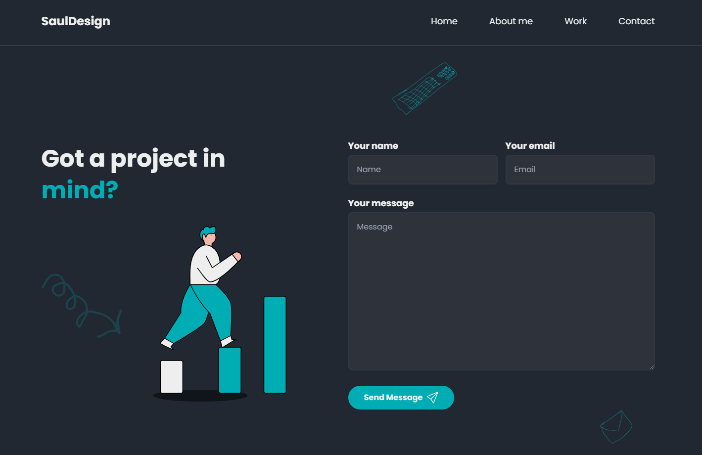

# My Portfolio Web Application


## Overview
This project is serves as a portfolio. The website is built with modern web technologies and features a responsive design that works on desktop and mobile devices. The goal of this project is to provide users with a seamless shopping experience and a user-friendly interface.

## Features
Send email<br>
Filter categories<br> 
Pagination<br> 

## Technologies
NextJS<br>
NodeJS<br>
TypeScript<br>
TailWindCSS<br>

## Getting Started

First, run the development server:

```bash
npm run dev
# or
yarn dev
# or
pnpm dev
```

Open [http://localhost:3000](http://localhost:3000) with your browser to see the result.

You can start editing the page by modifying `app/page.tsx`. The page auto-updates as you edit the file.

This project uses [`next/font`](https://nextjs.org/docs/basic-features/font-optimization) to automatically optimize and load Inter, a custom Google Font.

## Conclusion
Thank you for checking out my portfolio website! If you have any questions or feedback, please feel free to contact me. I hope you enjoy using this website as much as I enjoyed building it!